# MeMRecipesApp - GROUP PROJECT
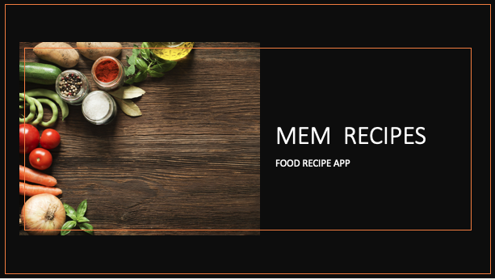
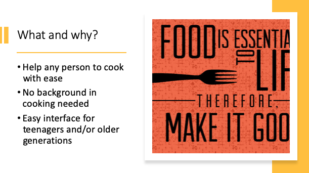

## System Design
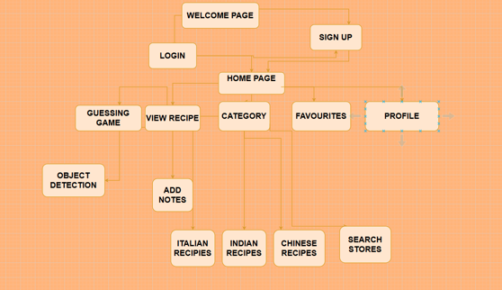

## Live Demo by our team is available on YouTube

<h4><a href="https://www.youtube.com/watch?v=y0p6CkpqlJ0&feature=youtu.be" target="_blank">Click here to Watch</a></h4> 

## Screenshots
1. Login-SignUp Page
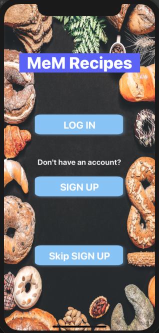

2. HomeScreen
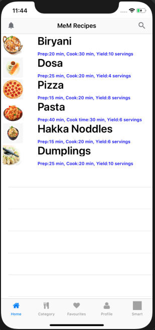

3. Recipes Page: This page will appears for the particular recipes that user will.
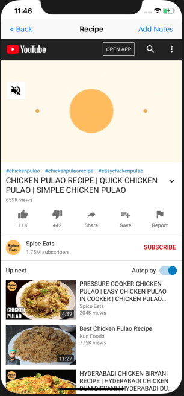

4. AddNote Page: User can add notes regarding recipes. That is, any item they think, they need to buy or anything.
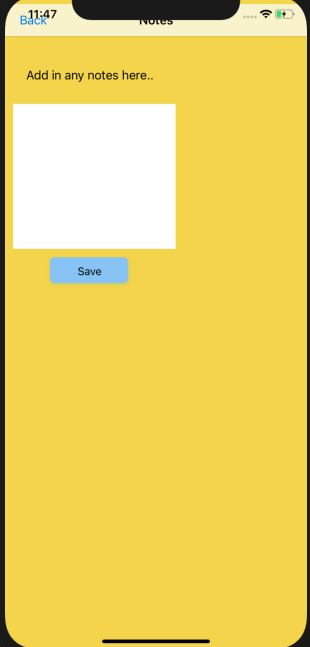

5. Category Page
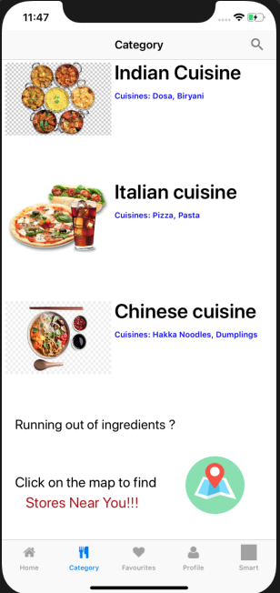

6. Favourites Page: Any recipes that user add as a favourite will appear on this page.
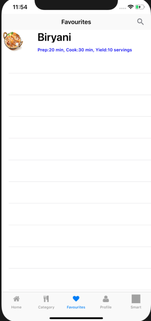

7. Profile Page
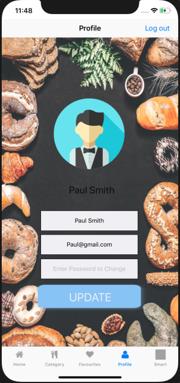

8. NotSure Page: This page helps user based on two scenarios: Not sure what to eat? (<i>gives user suggestions for cuizines</i>) and Not sure what Dish? (<i>use ML model to detect the dish name through phone camera</i>)
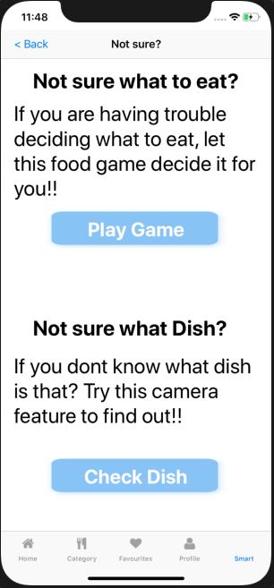
  
  
## SQLite database used for the data storage

 

