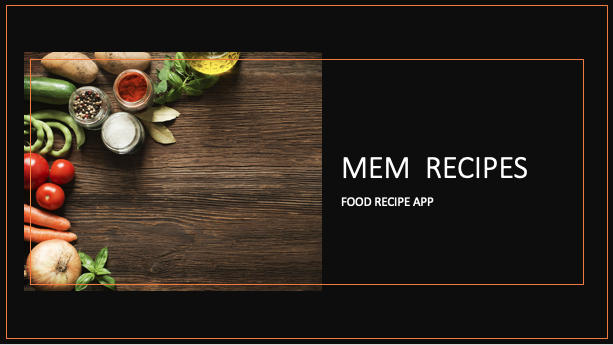
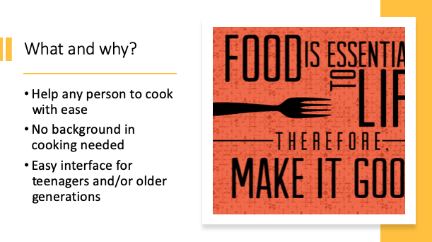
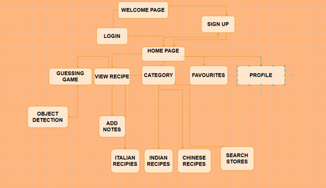

# MeMRecipesApp

## System Design

## Live Demo available on YouTube

<h4><a href="https://www.youtube.com/watch?v=y0p6CkpqlJ0&feature=youtu.be">Click here to Watch</a></h4>                                                             

## Screenshots

## mySQL database used for the data storage

 

